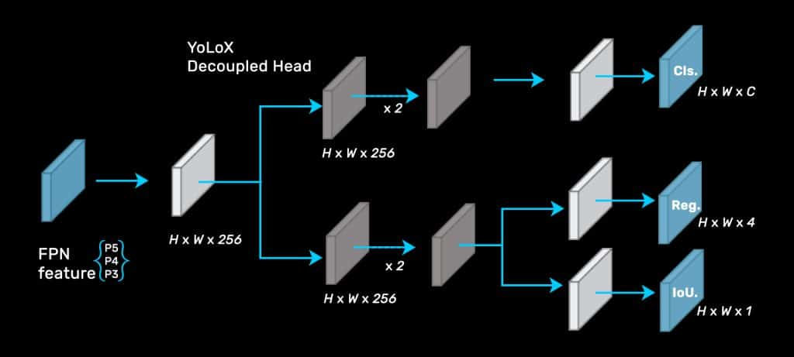

<!-- PROJECT LOGO -->
<br />
<p align="center">
  <a href="https://github.com/SamirGouda/YOLOX-Clothing_Classifier/tree/main/YOLOX-paper">
    
  </a>

  <h3 align="center">YOLOX paper</h3>

  <p align="center">
    
    
  </p>
</p>


<!-- TABLE OF CONTENTS -->
<details open="open">
  <summary>Table of Contents</summary>
  <ol>
    <li>
      <a href="#introduction">Introduction</a>
    <li><a href="#installation">Installation</a></li>
    <li><a href="#testing">Testing</a></li>
    <li><a href="#analysis">Analysis</a></li>
  </ol>
</details>


<!-- ABOUT THE PROJECT -->
## Introduction

i tested the [YOLOX](https://github.com/Megvii-BaseDetection/YOLOX) invested some time in their code and implementation of `yolox` in pytorch, and here's my thoughts


## Installation

please refer to [run.sh](run.sh) for installation steps
```
bash run.sh
```

## Testing

i reproduced COCO/eval results with YOLOX in [YOLOX_notebook](YOLOX_notebook.ipynb)

<!-- Data -->
## Analysis

- feedback
yolox is a great paper, with many improvements introduced to the yolo family, i liked how they decoupled the head and removed many default image augmentation and using advanced label assignment such as dynamic number of positive anchors and dropping anchors and its associated handcrafting engineering for assignment. i did not like the open-source code supplied due to its complexity. 


- potential areas of improvements
1. change backbone and neck
2. use efficient task aligned head like YOLOE


- main contribtuion
1. replace yolo's head with decoupled head
2. integrates NMS free detectors with yolo family
3. using joint losses: BCE Loss for training cls and obj branch, and IoU Loss for training reg branch
4. Removal of box anchors (improves the portability of the model to edge devices), anchor free

- what's new

1. decoupled head for classification and regression tasks
2. simOTA Advanced Label Assignment Strategy
3. strong augmentation (mixed-up and Mosaic)


<!-- [![fingers far from each other][screenshot-2]] -->

<!-- MARKDOWN LINKS & IMAGES -->
<!-- https://www.markdownguide.org/basic-syntax/#reference-style-links -->

[product-screenshot]: images/screenshot.png
[screenshot-2]: images/2.png